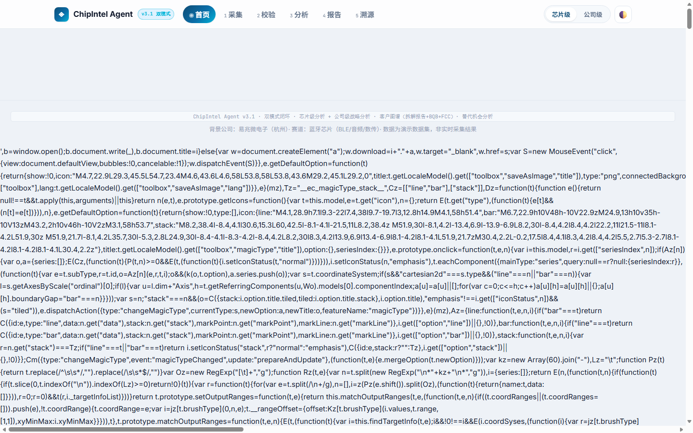
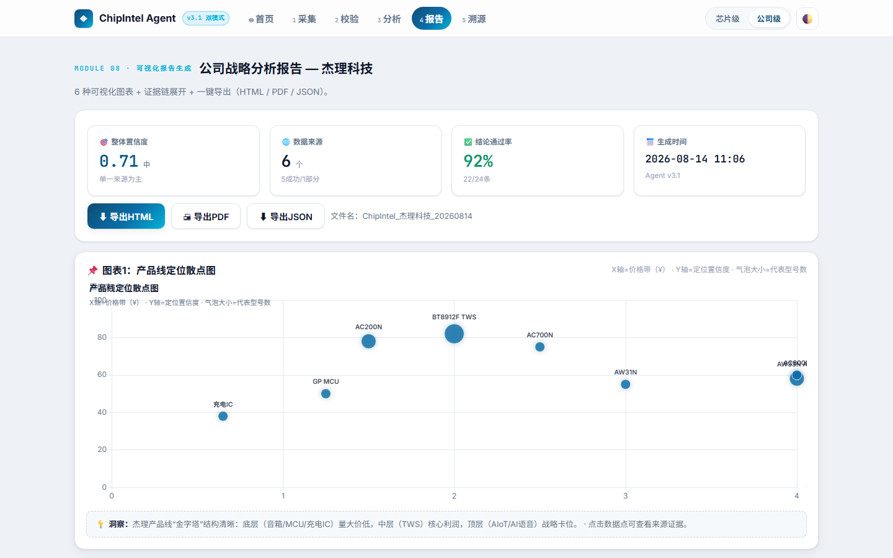
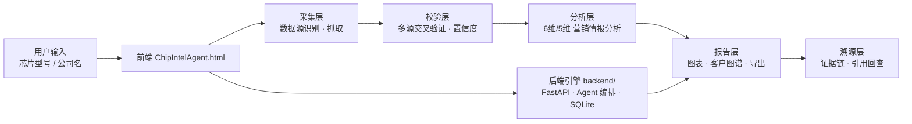

<div align="center">

# PM的学习之旅

**产品经理学习之旅 · 实战作品：ChipIntel Agent — AI 蓝牙芯片竞品情报 Agent**

一个完整的「AI 竞品情报 Agent」产品实战：从 PRD 到可运行的前端应用 + 后端引擎，
实现 采集 → 校验 → 分析 → 报告 → 溯源 的闭环，内置演示数据开箱即用。


</div>

---

## 📸 产品截图

| 首页 · 双模式入口 | 芯片级分析报告 |
| --- | --- |
|  |  |

| 公司级战略分析报告 |
| --- |
|  |

> 截图由真实页面渲染生成，点击可查看大图；直接打开 `ChipIntelAgent.html` 即可体验完整交互。

---

## ✨ 功能特性

- **双模式分析**：芯片级（单颗芯片 6 维营销情报） + 公司级（友商战略全貌 5 维分析）
- **Agent 闭环**：采集 → 校验 → 分析 → 报告 → 溯源，全流程可视化
- **证据链严谨**：高置信结论要求 ≥2 个独立来源交叉验证，4 层证据链（数据→发现→推论→建议）
- **置信度体系**：每个结论附带置信度分数，低置信自动标注
- **6 种可视化图表**：散点 / 柱状 / 雷达 / 热力 / 关系图谱 / 趋势
- **客户图谱**：拆解报告 + BQB + FCC 认证客户识别
- **替代机会分析**：芯片替代关系与厂商机会点
- **报告导出**：一键生成完整报告（前端 / 后端均可）
- **后端可选 LLM**：配置 `DEEPSEEK_API_KEY` 即启用真实推理，未配置自动降级为演示数据

---

## 🏗️ 架构总览



---

## 🚀 快速开始

### 前端（双击即用）

直接打开 `ChipIntelAgent.html`，或启动本地服务：

```bash
python -m http.server 8765
# 访问 http://127.0.0.1:8765/ChipIntelAgent.html
```

### 后端引擎

```bash
cd backend
pip install -r requirements.txt

# 芯片级分析
python run.py chip STM32F103

# 公司级分析（JSON 输出）
python run.py company 杰理科技 --json
```

> 如需真实 LLM 推理：复制 `backend/.env.example` 为 `backend/.env` 并填入 `DEEPSEEK_API_KEY`；未配置时自动使用内置演示数据。

---

## 📁 项目结构

```
PM的学习之旅/
├── ChipIntelAgent.html      # 前端单文件版（双击即用）
├── index.html               # 前端多文件版入口
├── prd.html                 # PRD 交互完善版（原型可交互）
├── PRD任务验收清单.md        # PRD 验收清单
├── assets/
│   ├── css/style.css        # 样式
│   ├── js/                  # 前端源码（app/charts/engine/data…）
│   └── screenshots/         # README 展示截图
├── backend/                 # 后端引擎
│   ├── run.py / main.py     # 入口
│   ├── app/                 # 采集/校验/置信度/报告/存储模块
│   ├── requirements.txt
│   └── .env.example
├── docs/prd.html            # PRD 原文备份
└── _shared/js/echarts.min.js
```

---

## ✅ 实测验证结果

芯片级 STM32F103：产品定位 0.62 / 价格 0.38 / 渠道 0.48 / 话术 0.55 / 技术参数 0.72 / 目标客户 0.12（低，已标注）——与 PRD 示例一致；自检 5/6 通过。

---

## 📄 License

[MIT](LICENSE) © 2026 Tazz-zhu
